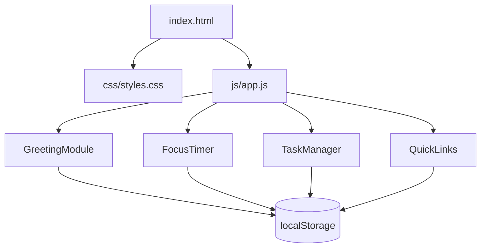

# Design Document

## Overview

The Life Dashboard is a single-page web application built with vanilla HTML, CSS, and JavaScript. It provides four core modules on one screen: a greeting/time display, a 25-minute Pomodoro focus timer, a persistent to-do list, and a quick-links panel. All state is persisted client-side via the browser's Local Storage API. There is no build step, no framework, and no backend.

The app is delivered as three files:
- `index.html` — markup and structure
- `css/styles.css` — all styling
- `js/app.js` — all logic

---

## Architecture

The app follows a module pattern inside a single `app.js` file. Each feature area is an IIFE-style module that owns its DOM interactions and storage key. A shared `Storage` utility wraps `localStorage` with JSON serialization. Modules communicate only through the DOM and their own storage keys — there are no shared mutable globals.



On `DOMContentLoaded`, each module initialises itself: reads from storage, renders its initial state, and attaches event listeners.

---

## Components and Interfaces

### GreetingModule

Responsible for displaying the current time, date, and a time-based greeting.

```
GreetingModule.init()
  - Renders time, date, greeting immediately
  - Schedules setInterval every 60 seconds to re-render
  - No storage interaction

GreetingModule.getGreeting(hour: number): string
  - 5–11  → "Good morning"
  - 12–17 → "Good afternoon"
  - 18–21 → "Good evening"
  - 22–4  → "Good night"

GreetingModule.formatTime(date: Date): string
  - Returns HH:MM (24-hour, zero-padded)

GreetingModule.formatDate(date: Date): string
  - Returns e.g. "Monday, July 14, 2025"
```

### FocusTimer

Manages the 25-minute countdown with start, stop, and reset controls.

```
FocusTimer.init()
  - Sets remaining = 1500
  - Renders MM:SS display
  - Attaches click handlers for start / stop / reset buttons

FocusTimer.start()
  - No-op if already running
  - Sets interval ticking every 1000 ms
  - On each tick: remaining -= 1, re-render
  - When remaining === 0: stop, show completion indicator

FocusTimer.stop()
  - Clears interval, preserves remaining value

FocusTimer.reset()
  - Clears interval, sets remaining = 1500, re-renders, clears completion indicator

FocusTimer.formatTime(seconds: number): string
  - Returns MM:SS zero-padded
```

### TaskManager

Handles adding, editing, completing, and deleting tasks. Persists to `localStorage` key `"tasks"`.

```
TaskManager.init()
  - Loads tasks from storage
  - Renders task list
  - Attaches submit handler on add form

TaskManager.addTask(label: string): void
  - Trims label; rejects if empty/whitespace-only
  - Creates Task { id, label, completed: false }
  - Appends to tasks array, saves, re-renders

TaskManager.editTask(id, newLabel: string): void
  - Trims newLabel; rejects if empty/whitespace-only (retains original)
  - Updates matching task, saves, re-renders

TaskManager.toggleTask(id): void
  - Flips task.completed, saves, re-renders

TaskManager.deleteTask(id): void
  - Removes task by id, saves, re-renders

TaskManager.save(): void
  - Writes tasks array to localStorage as JSON

TaskManager.render(): void
  - Clears list DOM, re-renders all tasks in insertion order
  - Completed tasks get CSS class "completed" (strikethrough)
  - Each task row has edit / complete / delete controls
```

### QuickLinks

Handles adding and deleting quick-link buttons. Persists to `localStorage` key `"links"`.

```
QuickLinks.init()
  - Loads links from storage
  - Renders link buttons
  - Attaches submit handler on add form

QuickLinks.addLink(label: string, url: string): void
  - Trims both; rejects if either is empty
  - Creates Link { id, label, url }
  - Appends to links array, saves, re-renders

QuickLinks.deleteLink(id): void
  - Removes link by id, saves, re-renders

QuickLinks.save(): void
  - Writes links array to localStorage as JSON

QuickLinks.render(): void
  - Clears links DOM, re-renders all links in insertion order
  - Each link opens in a new tab (target="_blank", rel="noopener")
```

### Storage Utility

```
Storage.get(key: string): any
  - JSON.parse(localStorage.getItem(key)) ?? null

Storage.set(key: string, value: any): void
  - localStorage.setItem(key, JSON.stringify(value))
```

---

## Data Models

### Task

```json
{
  "id": "string (timestamp-based unique id)",
  "label": "string (non-empty, trimmed)",
  "completed": "boolean"
}
```

Storage key: `"tasks"` — stored as a JSON array of Task objects.

### Link

```json
{
  "id": "string (timestamp-based unique id)",
  "label": "string (non-empty, trimmed)",
  "url": "string (non-empty)"
}
```

Storage key: `"links"` — stored as a JSON array of Link objects.

### Timer State

The timer is not persisted. It resets to 1500 seconds on every page load. This is intentional — a Pomodoro session is a live activity.

---

## Correctness Properties

*A property is a characteristic or behavior that should hold true across all valid executions of a system — essentially, a formal statement about what the system should do. Properties serve as the bridge between human-readable specifications and machine-verifiable correctness guarantees.*

### Property 1: Greeting correctness for all hours

*For any* hour value in [0, 23], `getGreeting(hour)` SHALL return exactly one of "Good morning", "Good afternoon", "Good evening", or "Good night", and the returned value SHALL match the correct time-of-day range (5–11 → morning, 12–17 → afternoon, 18–21 → evening, 22–4 → night).

**Validates: Requirements 1.3, 1.4, 1.5, 1.6**

### Property 2: Time formatting correctness

*For any* Date object, `formatTime(date)` SHALL return a string matching the pattern `HH:MM` where HH is the zero-padded 24-hour hour and MM is the zero-padded minute of that Date.

**Validates: Requirements 1.1**

### Property 3: Timer display formatting correctness

*For any* integer number of seconds in [0, 1500], `FocusTimer.formatTime(seconds)` SHALL return a string matching the pattern `MM:SS` where MM and SS are zero-padded and the total seconds represented equals the input.

**Validates: Requirements 2.5**

### Property 4: Timer reset always returns to initial state

*For any* timer state (any remaining value, running or stopped), calling `reset()` SHALL set remaining to 1500 and stop any active countdown.

**Validates: Requirements 2.4**

### Property 5: Start is idempotent while running

*For any* running timer state, calling `start()` again SHALL not change the countdown rate — the timer SHALL decrement by exactly 1 second per elapsed second regardless of how many times `start()` is called.

**Validates: Requirements 2.7**

### Property 6: Adding a valid task grows the list

*For any* task list state and any non-empty, non-whitespace-only string label, calling `addTask(label)` SHALL increase the tasks array length by exactly 1 and the new task SHALL appear as the last element with the trimmed label and `completed: false`.

**Validates: Requirements 3.2, 3.4**

### Property 7: Whitespace-only labels are always rejected

*For any* string composed entirely of whitespace characters (spaces, tabs, newlines), calling `addTask(label)` or `editTask(id, label)` SHALL leave the tasks array unchanged.

**Validates: Requirements 3.3, 4.3**

### Property 8: Edit with valid label updates the task

*For any* existing task and any non-empty, non-whitespace-only string, calling `editTask(id, newLabel)` SHALL update only that task's label to the trimmed value, leaving all other tasks and the `completed` field unchanged.

**Validates: Requirements 4.2**

### Property 9: Toggle completion is a round-trip

*For any* task with any initial `completed` state, calling `toggleTask(id)` twice SHALL return the task to its original `completed` value.

**Validates: Requirements 4.4**

### Property 10: Deleting a task removes it from the list

*For any* task list containing at least one task, calling `deleteTask(id)` SHALL remove exactly the task with that id, leaving all other tasks intact and in their original order.

**Validates: Requirements 4.6**

### Property 11: Task storage round-trip

*For any* sequence of task operations (add, edit, toggle, delete), the JSON stored under key `"tasks"` in localStorage SHALL always equal the current in-memory tasks array, and calling `TaskManager.init()` after those operations SHALL restore the identical tasks array.

**Validates: Requirements 5.1, 5.2**

### Property 12: Adding a valid link grows the links list

*For any* links list state and any non-empty label and non-empty URL string, calling `addLink(label, url)` SHALL increase the links array length by exactly 1 and the new link SHALL appear as the last element with the trimmed label and url.

**Validates: Requirements 6.2, 6.5**

### Property 13: Link with empty label or URL is always rejected

*For any* combination where label or URL is empty or whitespace-only, calling `addLink(label, url)` SHALL leave the links array unchanged.

**Validates: Requirements 6.3**

### Property 14: Deleting a link removes it from the list

*For any* links list containing at least one link, calling `deleteLink(id)` SHALL remove exactly the link with that id, leaving all other links intact and in their original order.

**Validates: Requirements 7.1**

### Property 15: Link storage round-trip

*For any* sequence of link operations (add, delete), the JSON stored under key `"links"` in localStorage SHALL always equal the current in-memory links array, and calling `QuickLinks.init()` after those operations SHALL restore the identical links array.

**Validates: Requirements 7.2, 7.3**

---

## Error Handling

| Scenario | Handling |
|---|---|
| `localStorage` unavailable (private mode, quota exceeded) | Wrap `Storage.set` in try/catch; log warning; app continues in-memory only |
| Corrupted JSON in storage | `Storage.get` returns `null` on parse error; modules treat `null` as empty array |
| Empty/whitespace task label on add or edit | Silently reject; no error message required beyond preventing the action |
| Empty label or URL on link add | Silently reject |
| Timer start called while running | No-op; no error |
| Timer reaches zero | Auto-stop; show completion indicator; no error |
| Invalid URL in quick link | No client-side URL validation beyond non-empty check; browser handles navigation errors |

---

## Testing Strategy

### Approach

Because this is a vanilla JS app with pure functions for formatting, validation, and data transformation, property-based testing is well-suited for the core logic. The UI rendering and DOM interactions are covered by example-based unit tests.

**No test framework setup is required by the non-functional requirements.** Tests are written as plain JavaScript using a minimal property-based testing helper (e.g., a small custom `forAll` runner or a CDN-loaded library like `fast-check`). Tests can be run directly in the browser via a `test.html` file, or in Node.js with no bundler.

### Unit Tests (Example-Based)

Cover specific scenarios and edge cases:

- Timer initialises to 1500 seconds
- Timer stops at zero and shows completion indicator
- `TaskManager.init()` with empty storage renders empty list without errors
- `QuickLinks.init()` with empty storage renders empty state without errors
- Edit control pre-fills input with current task label
- Link button has `target="_blank"` and correct `href`
- `Storage.get` returns `null` for missing or corrupted keys

### Property Tests

Each property from the Correctness Properties section maps to one property-based test. Minimum 100 iterations per test.

Tag format: `// Feature: vanilla-js-web-app, Property N: <property text>`

| Test | Property | Iterations |
|---|---|---|
| Greeting correctness for all hours | Property 1 | 100 |
| Time formatting correctness | Property 2 | 100 |
| Timer display formatting | Property 3 | 100 |
| Timer reset always returns to 1500 | Property 4 | 100 |
| Start is idempotent while running | Property 5 | 100 |
| Adding valid task grows list | Property 6 | 100 |
| Whitespace labels always rejected | Property 7 | 100 |
| Edit with valid label updates task | Property 8 | 100 |
| Toggle completion round-trip | Property 9 | 100 |
| Delete removes correct task | Property 10 | 100 |
| Task storage round-trip | Property 11 | 100 |
| Adding valid link grows list | Property 12 | 100 |
| Empty label/URL always rejected | Property 13 | 100 |
| Delete removes correct link | Property 14 | 100 |
| Link storage round-trip | Property 15 | 100 |

### Recommended Library

Use [fast-check](https://github.com/dubzzz/fast-check) (available via CDN or npm) for property-based test generation. It provides arbitraries for strings, integers, arrays, and records that cover the input spaces needed for all 15 properties above.
